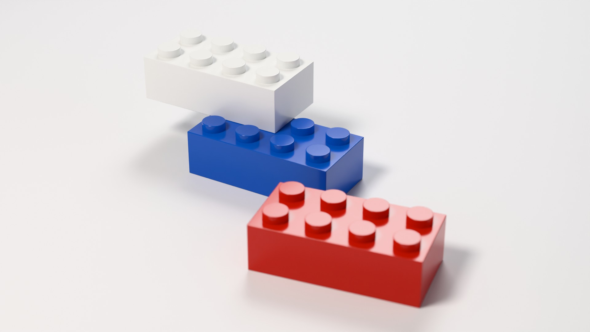
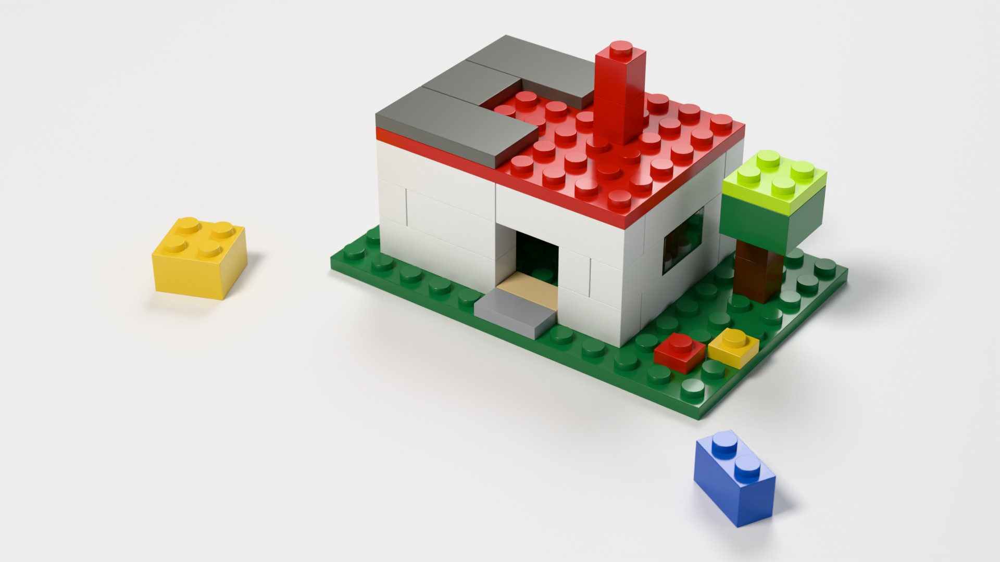
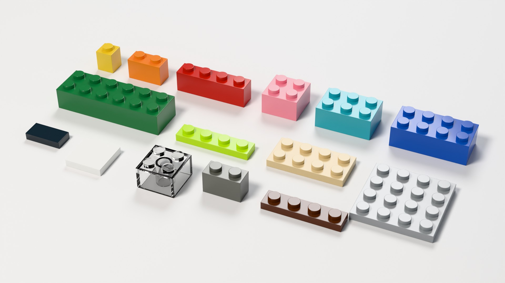
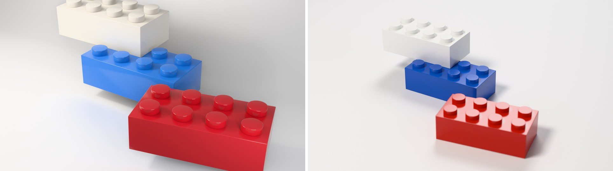

# bloques3d

Piezas tipo LEGO **paramétricas y con medidas reales** (en mm), escenas descritas
en JSON que se **validan antes de construirlas**, y un solo comando que las
monta en Blender sin interfaz. Ese comando encuadra la cámara, renderiza y
exporta STL para imprimir, GLB para la web y un vídeo giratorio MP4.



*`escenas/trio.json`: el blanco está encajado de verdad en 2 studs del azul, y
todas las piezas apoyan en z = 0 o sobre studs. Cycles, 1920×1080, 64 muestras.*

## Qué hace

- **Piezas con geometría real.** Cada pieza tiene hueco inferior con paredes de
  1.2 mm y studs de Ø4.8 mm fusionados con la cara superior. Las 2xN llevan
  tubos inferiores y las 1xN barras. La malla se construye con `bmesh`, es una
  sola superficie cerrada (se puede imprimir) y lleva el origen en la base:
  z = 0 es "apoyada".
- **Escenas declarativas.** Cada pieza se coloca con posición en studs, nivel
  en placas y rotación. El validador rechaza solapes y piezas flotantes, y
  explica el problema en español con el nombre de la pieza.
- **Cámara automática.** Calcula la posición más cercana que deja toda la
  escena dentro del encuadre con margen. Ya no hay que recolocarla a mano.
- **Estudio fotográfico.** Fondo infinito, tres luces calibradas, plástico ABS
  con capa de barniz, piezas transparentes y profundidad de campo física. Se
  renderiza con EEVEE o con Cycles.
- **Comprobación geométrica** del `.blend` resultante: encuadre, contacto con
  el suelo, interpenetración entre piezas y mallas cerradas.
- **Exportaciones:** STL en mm por tipo de pieza, GLB de la escena y MP4 de una
  vuelta completa.

## Galería

| | |
|---|---|
|  |  |
| `escenas/casita.json`: 38 piezas y 53 conexiones por studs. Muros 1xN en aparejo, ventanas transparentes, dintel, tejado de placa con baldosas, un árbol y dos piezas sueltas. | `escenas/catalogo.json`: el catálogo de serie. En el 2x2 transparente se ve el hueco inferior con su tubo. |

**Antes y después** del mismo plano: a la izquierda el render original, a la
derecha el nuevo.



En el original los ladrillos flotaban 4.8 mm (fíjate en las sombras separadas),
el blanco atravesaba al azul y la cámara cortaba los studs del blanco. Los
detalles y cómo se comprueba están en [`historial/`](historial/LEEME.md).

## Inicio rápido

Requisitos: **Python 3.11+** (probado con 3.14) y **Blender 5.0+** (probado con
5.2.1). No hay dependencias externas; `pytest` solo hace falta para las pruebas.

```bash
python -m venv .venv
.venv/Scripts/python -m pip install -e ".[test]"   # Windows (en Linux/macOS: .venv/bin/python)
source .venv/Scripts/activate                       # PowerShell: .venv\Scripts\Activate.ps1

python -m bloques3d catalogo                        # piezas de serie y medidas
python -m bloques3d validar escenas/*.json          # solapes y soporte, sin abrir Blender
python -m bloques3d render escenas/trio.json --res 1280x720 --muestras 32
python -m bloques3d comprobar salida/trio.blend     # geometría del .blend generado
```

`render` escribe `salida/trio.blend` y `salida/trio.png`. El `.blend` guarda la
ruta de render en relativo (`//trio.png`), así que se puede abrir y renderizar
con F12 en cualquier PC.

**Cómo se encuentra Blender:** primero `--blender RUTA`, luego la variable
`BLENDER_EXE`, luego `blender` en el `PATH` y por último la instalación estándar
(en Windows, la versión más nueva de `Program Files\Blender Foundation`).
`python -m bloques3d blender` muestra cuál se usará. Siempre se lanza con
`--background --factory-startup`, así que no toca una sesión de Blender abierta
ni tus add-ons o preferencias.

## Formato de escena

```json
{
  "nombre": "trio",
  "descripcion": "texto libre",
  "camara": {"azimut": 30, "elevacion": 30, "lente": 70, "margen": 0.07, "enfoque": "azul", "apertura": 22},
  "fondo": "#EDEDEF",
  "piezas": [
    {"id": "azul",   "pieza": "ladrillo_2x4", "color": "azul",   "pos": [0, 0]},
    {"id": "blanco", "pieza": "ladrillo_2x4", "color": "blanco", "pos": [-2, 1], "nivel": 3},
    {"id": "rojo",   "pieza": "ladrillo_2x4", "color": "rojo",   "pos": [3.4, -2.6], "angulo": 9}
  ]
}
```

| Campo de pieza | Significado |
|---|---|
| `pieza` | `ladrillo_AxB`, `placa_AxB` o `baldosa_AxB`: A studs de ancho (eje Y) y B de largo (eje X). Vale cualquier tamaño de 1 a 32, no solo los del catálogo. |
| `color` | `blanco`, `negro`, `gris_claro`, `gris_oscuro`, `rojo`, `azul`, `amarillo`, `verde`, `verde_lima`, `naranja`, `azul_claro`, `beige`, `marron`, `rosa`, `transparente`. |
| `pos` | `[x, y]` de la celda de la esquina mínima de la huella, en studs. Enteros en la rejilla. |
| `nivel` | Altura de la cara inferior en placas (1 ladrillo = 3 placas). Por defecto 0, el suelo. |
| `rot` | 0, 90, 180 o 270 grados sobre el centro de la pieza. |
| `angulo` | Giro libre en grados, **solo para piezas sueltas en el suelo** (nivel 0). No se enganchan a la rejilla, admiten `pos` decimal y nada se apoya en ellas. |
| `id` | Nombre único. Es el nombre del objeto en Blender y del nodo en el GLB. |

| Campo de `camara` | Por defecto | Significado |
|---|---|---|
| `azimut` | 32 | Grados. 0 = cámara delante (en −Y), crece hacia +X. |
| `elevacion` | 30 | Grados sobre el horizonte. |
| `lente` | 70 | Focal en mm (sensor de 36 mm). |
| `margen` | 0.07 | Fracción del encuadre que queda libre en cada borde. |
| `enfoque` | centro | `id` de la pieza enfocada. |
| `apertura` | sin desenfoque | Número f **físico**: a f/11 un ladrillo a 20 cm ya se desenfoca como en una foto macro real. |

**Qué valida** (`bloques3d validar`, y otra vez dentro de Blender antes de construir):

- **Solapes.** Dos piezas no pueden ocupar la misma celda (x, y, nivel). Las
  piezas sueltas y giradas se comprueban con el teorema del eje separador.
- **Soporte.** Toda pieza tiene que estar unida al suelo por una cadena de
  conexiones de studs. Vale colgar una pieza de otra que esté bien sujeta. Una
  baldosa no sujeta nada porque no tiene studs.
- **Formato.** Claves desconocidas (atrapa erratas como `nivle`), colores,
  piezas, rangos de cámara e ids repetidos. Se informa de todos los errores a
  la vez:

```text
MAL escenas/mala.json no es válida (2 problema(s)):
  - la pieza 'b' se solapa con 'a': las dos ocupan la celda (x=1, y=0) en el nivel 0
  - la pieza 'tejado' (nivel 6) está flotando: ningún stud la sujeta: no hay piezas con studs justo debajo (nivel 5) ni justo encima
```

## Catálogo de serie

`python -m bloques3d catalogo` (y `--json`):

| Clave | Medidas con studs (mm) | Studs | Tubos | Barras |
|---|---|---:|---:|---:|
| `ladrillo_1x1` | 7.8 × 7.8 × 11.3 | 1 | 0 | 0 |
| `ladrillo_1x2` | 15.8 × 7.8 × 11.3 | 2 | 0 | 1 |
| `ladrillo_1x4` | 31.8 × 7.8 × 11.3 | 4 | 0 | 3 |
| `ladrillo_2x2` | 15.8 × 15.8 × 11.3 | 4 | 1 | 0 |
| `ladrillo_2x3` | 23.8 × 15.8 × 11.3 | 6 | 2 | 0 |
| `ladrillo_2x4` | 31.8 × 15.8 × 11.3 | 8 | 3 | 0 |
| `ladrillo_2x6` | 47.8 × 15.8 × 11.3 | 12 | 5 | 0 |
| `placa_1x4` | 31.8 × 7.8 × 4.9 | 4 | 0 | 3 |
| `placa_2x4` | 31.8 × 15.8 × 4.9 | 8 | 3 | 0 |
| `placa_4x4` | 31.8 × 31.8 × 4.9 | 16 | 9 | 0 |
| `baldosa_1x2` | 15.8 × 7.8 × 3.2 | 0 | 0 | 1 |
| `baldosa_2x2` | 15.8 × 15.8 × 3.2 | 0 | 1 | 0 |

Cualquier otro tamaño se genera igual (`placa_8x12`, `ladrillo_1x6`...). La
casita usa 13 tipos distintos.

## Medidas de referencia

Todo sale de [`bloques3d/medidas.py`](bloques3d/medidas.py) (1 unidad = 1 mm):

| Medida | Valor | Nota |
|---|---:|---|
| Paso entre studs | 8.0 | |
| Altura de ladrillo / placa | 9.6 / 3.2 | 1 ladrillo = 3 placas |
| Stud | Ø4.8 × 1.7 | |
| Pared lateral / techo | 1.2 / 1.0 | |
| Tubo inferior (2xN) | Ø6.51 exterior, Ø4.8 interior | Tangente a los 4 studs que rodea (holgura de 0.002 mm) |
| Barra inferior (1xN) | Ø3.2 | Tangente a los 2 studs vecinos |
| Holgura | 0.1 por lado | Un 2x4 mide 31.8 × 15.8, no 32 × 16 |

El bisel (0.15 mm) solo redondea aristas **convexas**. Un redondeo cóncavo en la
base del stud metería material justo donde apoyan los tubos y barras de la pieza
de encima.

## Render

```bash
python -m bloques3d render escenas/casita.json --motor cycles --res 1920x1080 --muestras 64 --jpeg
```

| Opción | Por defecto | |
|---|---|---|
| `--res ANCHOxALTO` | 1920x1080 | |
| `--muestras N` | 64 | |
| `--motor eevee\|cycles` | eevee | Cycles usa la CPU y elimina el ruido con OpenImageDenoise. |
| `--salida DIR` | `salida` | Escribe `<escena>.blend`, `.png` y, con `--jpeg`, `.jpg`. |
| `--sin-render` | | Solo construye y guarda el `.blend` (y las exportaciones pedidas). |
| `--blender RUTA` | | Ver "Cómo se encuentra Blender". |
| `-v` | | Muestra toda la salida de Blender. |

Tiempos medidos en el PC de desarrollo (Intel UHD 770 sin gráfica dedicada, Blender 5.2.1):

| Escena | Ajustes | Render |
|---|---|---:|
| trio | EEVEE, 640×360, 16 muestras | 4.2 s |
| trio | Cycles, 1920×1080, 64 muestras | 94 s |
| casita / catalogo | Cycles, 1920×1080, 64 muestras | ~2 min |

A mano, sin la CLI:

```bash
blender --background --factory-startup --python bloques3d/blender/construir.py -- --escena escenas/trio.json --res 1280x720 --muestras 32
```

## Comprobación geométrica

`python -m bloques3d comprobar ARCHIVO.blend` abre el archivo en Blender sin
interfaz y comprueba la malla **evaluada** (con el bisel):

- **encuadre:** todos los vértices de todas las piezas caen dentro de
  `[margen, 1 − margen]` en la cámara activa (`--margen`, por defecto 0.03);
- **suelo:** las piezas de nivel 0 tienen su punto más bajo exactamente en
  z = 0, y ninguna baja de ahí;
- **interpenetración:** en cada par de piezas que se tocan, con la de arriba
  elevada 1 micra `BVHTree.overlap` no encuentra ningún par de caras, y ningún
  vértice queda dentro del sólido de la otra (paridad de rayos por mayoría de
  tres direcciones);
- **mallas cerradas:** ninguna arista abierta.

```text
$ python -m bloques3d comprobar salida/casita.blend
encuadre   u 0.151..0.849   v 0.061..0.939   (margen exigido 0.03)
suelo      3 piezas con z mínima = 0, 0, 0
contactos  53 pares de piezas que se tocan; con 1 micra de separación se cruzan 0 pares de caras; vértices enterrados: 0
manifold   0 aristas abiertas en 13 mallas
OK
```

Sobre el `.blend` original sale con código 1 y lista los cuatro fallos (ver
[`historial/`](historial/LEEME.md)).

## Exportaciones

```bash
python -m bloques3d render escenas/trio.json --sin-render --stl salida/stl --glb salida/trio.glb
python -m bloques3d render escenas/trio.json --res 640x360 --muestras 16 --turntable 48
```

- **`--stl DIR`:** un STL binario por tipo de pieza, en mm, sin girar y
  apoyado en z = 0, con el bisel aplicado. Es estanco: cada arista la
  comparten exactamente dos triángulos. Se puede llevar tal cual al
  laminador; la holgura de 0.1 mm por lado es la del molde original, y para
  imprimir quizá quieras más.
- **`--glb FICHERO`:** la escena en glTF binario, en metros (la unidad de
  glTF). Lleva un nodo por pieza con su `id` y, en `extras`, la pieza, el
  color y la posición. Los materiales usan `KHR_materials_clearcoat`.
- **`--turntable N`** (o `--giro N`): `salida/<escena>_giro.mp4` (H.264, 24 fps)
  con una vuelta completa de N fotogramas, en bucle y sin fotograma repetido.
  Cámara y luces orbitan juntas, como una plataforma giratoria bajo luces
  fijas, a la distancia justa para que la escena quepa desde cualquier
  ángulo. 24 fotogramas a 640×360 tardan unos 30 s con EEVEE.

## Pruebas

```bash
python -m pytest -q                   # todo: 136 pruebas, alrededor de 1 minuto
python -m pytest -q -m "not blender"  # solo Python puro: 116 pruebas, unos 10 s
```

- **Python puro:** medidas y recuentos de cada pieza, validación de escenas
  (solapes, flotantes, colgar desde arriba, baldosas, errores de formato),
  geometría del encuadre (márgenes con cámaras al azar, centrado, órbita), la
  CLI con un Blender falso y el cliente BlenderMCP contra un servidor falso.
- **Integración con Blender** (`tests/blender/`; se saltan solas si no hay
  Blender): cada pieza del catálogo es cerrada, mide lo especificado con
  0.01 mm de tolerancia y apoya en z = 0. Ocho apilados (entre ellos 1x4
  sobre 1x1, placa 4x4 sobre 2x2 y 2x4 girado) encajan sin atravesarse. El
  render de punta a punta genera `.blend` portable, PNG y JPEG. Se comprueban
  además el STL (medidas y estanqueidad), el GLB (nodos, escala, materiales),
  el MP4 (24 fotogramas), Cycles, la casita completa y que el comprobador
  detecta los fallos del original.

Todo corre en local y sin red: no hay claves ni servicios externos.

## Estructura

```text
bloques3d/
  medidas.py      medidas y plan geométrico de cada pieza (Python puro)
  escena.py       formato JSON, colisiones y soporte (Python puro)
  encuadre.py     cámara automática (Python puro)
  paleta.py       colores ABS
  cli.py          python -m bloques3d ...
  blender/
    malla.py      malla con bmesh
    estudio.py    unidades, motor, materiales, fondo, luces, cámara
    exportar.py   STL, GLB y vídeo giratorio
    construir.py  script de entrada para Blender
    comprobar.py  comprobaciones geométricas de un .blend
escenas/          trio, casita, catalogo
tests/            pruebas (tests/blender: integración)
galeria/          renders del README
entrega/          paquete listo para abrir en Blender (trio.blend + render + LEEME)
historial/        la sesión original con BlenderMCP, sin mantener
_tools/bclient.py cliente del addon BlenderMCP
```

## Cliente BlenderMCP (`_tools/bclient.py`)

Es la herramienta con la que se hizo la versión original: manda comandos a un
Blender **abierto** con el addon BlenderMCP. El generador no la necesita.

```bash
python _tools/bclient.py --help
python _tools/bclient.py get_scene_info                            # 127.0.0.1:9876
python _tools/bclient.py --port 9877 execute_code --code-file script.py
```

El destino también se puede fijar con `BLENDER_MCP_HOST` y `BLENDER_MCP_PORT`.
Ya no se cae si una respuesta trae un carácter UTF-8 partido entre dos
paquetes TCP (la `ñ` de "Año", por ejemplo).
